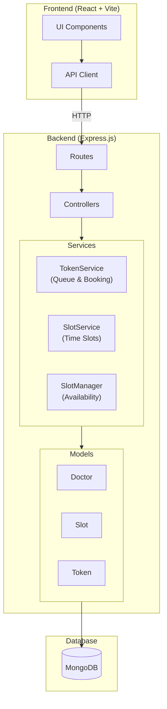

# SlotSaarthi - OPD Token Allocation Engine

A priority-based hospital OPD queue management system with dynamic scheduling, elastic emergency capacity, and anti-starvation algorithms.

## Key Features

### Priority-Based Scheduling
- **5-tier priority system:** Emergency > Paid > Online > Walk-in > Follow-up
- Numerical priority weights ensure predictable queue ordering
- Emergency patients can book even when slots are full (elastic overflow)

### Anti-Starvation Algorithm
- Dynamic priority aging prevents low-priority patients from waiting indefinitely
- Priority score decreases over time: `EffectivePriority = BasePriority - (WaitTimeMinutes × 0.5)`
- Example: A Walk-in patient (priority 30) waiting 60 minutes gains priority 0, equal to Emergency

### Real-Time Queue Management
- Live queue dashboard with 15-second auto-refresh
- Displays wait time and effective priority score for each patient
- Cancel and No-Show actions with confirmation dialogs
- "Call Next Patient" workflow for doctors

### Appointment Booking System
- Two-step booking flow: Select Doctor/Date → Choose Time Slot → Confirm
- Dynamic slot availability based on doctor schedules
- Emergency override: Emergency patients can book already-occupied slots
- Automatic token generation with unique IDs

### Doctor Management
- Register doctors with specialty and consultation duration
- Configure working days and availability hours
- Update doctor schedules on the fly

### Cancellation & No-Show Handling
- Token cancellation with status tracking
- No-Show marking for analytics
- Cancelled/No-Show tokens excluded from active queue

## Tech Stack

| Layer | Technology |
|-------|------------|
| Backend | Node.js, Express.js, MongoDB |
| Frontend | React (Vite), Tailwind CSS |
| Architecture | MVC with Service Layer |

## Architecture



## Quick Start

### Prerequisites
- Node.js v18+
- MongoDB (local or Atlas)

### Backend Setup

```bash
cd backend
npm install
cp .env.example .env   # Configure MONGODB_URI
npm start              # Runs on :5000
```

### Frontend Setup

```bash
cd frontend
npm install
npm run dev            # Runs on :5173
```

## API Endpoints

### Doctors
| Method | Endpoint | Description |
|--------|----------|-------------|
| POST | `/api/doctors` | Register doctor |
| GET | `/api/doctors` | List all doctors |
| GET | `/api/doctors/:id` | Get doctor by ID |
| PUT | `/api/doctors/:id` | Update doctor |

### Slots
| Method | Endpoint | Description |
|--------|----------|-------------|
| POST | `/api/slots/initialize` | Initialize daily slots |
| GET | `/api/slots/available/:doctorId/:date` | Get available slots |
| GET | `/api/slots/:doctorId` | Get today's slots |
| GET | `/api/slots/:doctorId/current` | Get current active slot |

### Tokens
| Method | Endpoint | Description |
|--------|----------|-------------|
| POST | `/api/tokens/book` | Book appointment |
| GET | `/api/queue/:doctorId` | Get live queue |
| PATCH | `/api/tokens/:id/status` | Update token status |
| POST | `/api/tokens/next/:doctorId` | Call next patient |
| PATCH | `/api/tokens/:id/cancel` | Cancel token |
| PATCH | `/api/tokens/:id/no-show` | Mark as no-show |

## Configuration

Edit `backend/config/settings.js`:

```javascript
// Priority Weights (Lower = Higher Priority)
PRIORITY_WEIGHTS: {
  Emergency: 0,   // Highest
  Paid: 10,
  Online: 20,
  Walk_in: 30,
  Follow_up: 40   // Lowest
}

// Anti-Starvation Settings
AGING_FACTOR: 0.5  // Priority reduction per minute of waiting

// Slot Settings
SLOT_DURATION_MINUTES: 60
DEFAULT_DURATION: 15        // Consultation duration per patient
DEFAULT_MAX_CAPACITY: 10    // Max patients per slot
MAX_OVERFLOW_CAPACITY: 1    // Emergency slots per time

// Working Hours
DEFAULT_START_TIME: '09:00'
DEFAULT_END_TIME: '17:00'
DEFAULT_WORKING_DAYS: [1, 2, 3, 4, 5]  // Monday to Friday
```

## Priority Algorithm

```
EffectivePriorityScore = BasePriority - (WaitTimeMinutes × AGING_FACTOR)
```

| Scenario | Calculation | Result |
|----------|-------------|--------|
| Walk-in (30) waiting 60 min | 30 - (60 × 0.5) | Priority 0 (= Emergency) |
| Paid (10) just arrived | 10 - (2 × 0.5) | Priority 9 |
| Follow-up (40) waiting 40 min | 40 - (40 × 0.5) | Priority 20 (= Online) |

## Frontend Views

### Book Appointment
- Select doctor from dropdown
- Pick appointment date
- View available time slots (color-coded: green = available, red = full, yellow = overflow)
- Enter patient details and booking type
- Receive token confirmation

### Queue Dashboard
- Real-time queue with priority-sorted patient list
- Patient cards show: Name, Type, Token ID, Wait Time, Effective Priority
- Action buttons: Cancel (removes from queue) and No-Show (marks for analytics)
- "Call Next" button advances queue

### Register Doctor
- Add new doctors with specialty
- Configure consultation duration and working hours
- Set weekly availability schedule

## Project Structure

```
SlotSaarthi/
├── backend/
│   ├── config/
│   │   └── settings.js        # All configuration
│   ├── src/
│   │   ├── models/
│   │   │   ├── Doctor.js      # Doctor schema
│   │   │   ├── Slot.js        # Time slot schema
│   │   │   └── Token.js       # Patient token schema
│   │   ├── controllers/
│   │   │   ├── doctorController.js
│   │   │   ├── slotController.js
│   │   │   └── tokenController.js
│   │   ├── services/
│   │   │   ├── SlotService.js   # Slot logic
│   │   │   ├── SlotManager.js   # Availability logic
│   │   │   └── TokenService.js  # Queue & booking logic
│   │   ├── routes/
│   │   │   ├── doctorRoutes.js
│   │   │   ├── slotRoutes.js
│   │   │   ├── tokenRoutes.js
│   │   │   └── queueRoutes.js
│   │   └── utils/
│   │       └── connectdb.js     # MongoDB connection
│   └── server.js
├── frontend/
│   ├── src/
│   │   ├── api/
│   │   │   └── client.js        # API client
│   │   ├── components/
│   │   │   ├── PatientBookingView.jsx
│   │   │   ├── QueueDashboard.jsx
│   │   │   ├── DoctorRegistrationView.jsx
│   │   │   └── ui/              # Reusable UI components
│   │   └── App.jsx              # Main app with tab navigation
│   └── vite.config.js
├── Architecture.png
└── README.md
```

## Token Statuses

| Status | Description |
|--------|-------------|
| `Pending` | Patient is in queue, waiting to be called |
| `Active` | Patient is currently being attended |
| `Completed` | Consultation finished |
| `Cancelled` | Token cancelled by staff/patient |
| `No_Show` | Patient did not arrive |

## Responsive Design

- Desktop: Full three-tab layout with side-by-side views
- Mobile: Hamburger menu navigation with stacked components
- Touch-friendly buttons and controls

## License

ISC