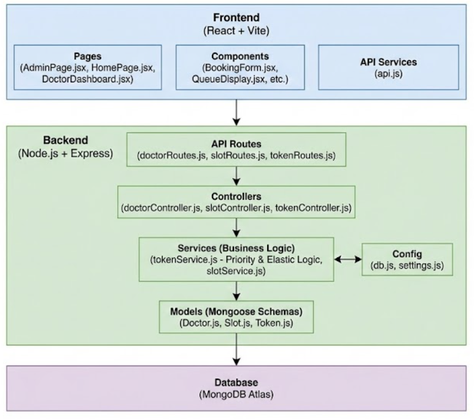

# SlotSaarthi - OPD Token Allocation Engine

A priority-based hospital OPD queue management system with dynamic scheduling, elastic emergency capacity, and anti-starvation algorithms.



## Features

- **Priority-Based Scheduling:** Emergency > Paid > Online > Walk-in > Follow-up
- **Anti-Starvation Algorithm:** Dynamic priority aging prevents low-priority patients from waiting indefinitely
- **Elastic Emergency Capacity:** Emergencies can book even when slots are full
- **Real-Time Queue Dashboard:** Live updates with cancel/no-show actions
- **Mobile Responsive:** Hamburger menu for mobile screens

## Tech Stack

| Layer | Technology |
|-------|------------|
| Backend | Node.js, Express.js, MongoDB |
| Frontend | React (Vite), Tailwind CSS |
| Architecture | MVC with Service Layer |

## Quick Start

### Prerequisites
- Node.js v18+
- MongoDB (local or Atlas)

### Backend Setup

```bash
cd backend
npm install
cp .env.example .env   # Configure MONGODB_URI
npm start              # Runs on :5000
```

### Frontend Setup

```bash
cd frontend
npm install
npm run dev            # Runs on :5173
```

## API Endpoints

| Method | Endpoint | Description |
|--------|----------|-------------|
| POST | `/api/doctors` | Register doctor |
| GET | `/api/doctors` | List all doctors |
| PUT | `/api/doctors/:id` | Update doctor |
| GET | `/api/slots/available/:doctorId/:date` | Get available slots |
| POST | `/api/tokens/book` | Book appointment |
| GET | `/api/queue/:doctorId` | Get live queue |
| POST | `/api/tokens/next/:doctorId` | Call next patient |
| PATCH | `/api/tokens/:id/cancel` | Cancel token |
| PATCH | `/api/tokens/:id/no-show` | Mark as no-show |

## Configuration

Edit `backend/config/settings.js`:

```javascript
PRIORITY_WEIGHTS: {
  Emergency: 0,   // Highest
  Paid: 10,
  Online: 20,
  Walk_in: 30,
  Follow_up: 40   // Lowest
}

AGING_FACTOR: 0.5  // Priority reduction per minute of waiting
MAX_OVERFLOW_CAPACITY: 1  // Emergency slots per time
```

## Priority Algorithm

```
EffectivePriority = BasePriority - (WaitTimeMinutes × AGING_FACTOR)
```

A Walk-in patient (priority 30) waiting 60 minutes has effective priority 0, equal to Emergency.

## Project Structure

```
SlotSaarthi/
├── backend/
│   ├── config/settings.js    # Configuration
│   ├── src/
│   │   ├── models/           # MongoDB schemas
│   │   ├── controllers/      # Request handlers
│   │   ├── services/         # Business logic
│   │   └── routes/           # API routes
│   └── server.js
├── frontend/
│   ├── src/
│   │   ├── api/client.js     # API client
│   │   ├── components/       # React components
│   │   └── App.jsx
│   └── vite.config.js
└── README.md
```

## License

ISC